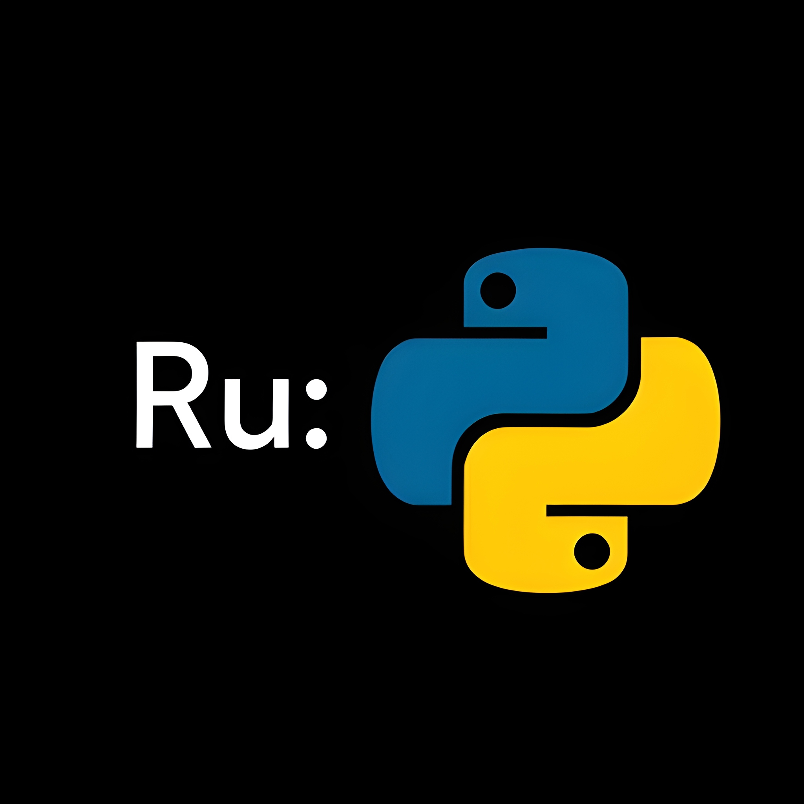

# PyIDE Python Project Templater

<br>
<div align="center">



</div>
<br>

This is a simple Python project templater that creates a basic project structure for a Python project:
```bash
.
├── .git/
├── .venv/
├── .gitignore
└── main.py

2 directories, 2 files
```
The newly created project will have version control (`git`), a virtual environment, a `.gitignore` file in which the `.venv` directory is flagged, and a `main.py` file.
## Usage
```bash
$ ./pyide <project_name> -m <modules>
```
For more specific information:
```bash
$ ./pyide --help
```
Optionally you can specify the Python package and project manager you want to use:
### `uv-python`
```bash
$ ./pyide <project_name> -m <modules> -u
```
### `pip`
```bash
$ ./pyide <project_name> -m <modules> -p
```
It's also possible to specify the editor you'd like to use:
```bash
$ ./pyide <project_name> -m <modules> -i <editor>
```
Where `<editor>` can be one of the following:
- `vscode`
- `pycharm`
- `zed`
## Compilation
```bash
$ cargo build --release
```
